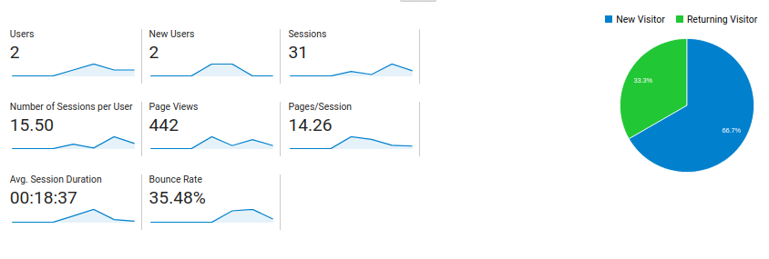
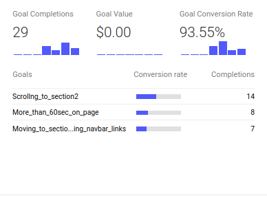
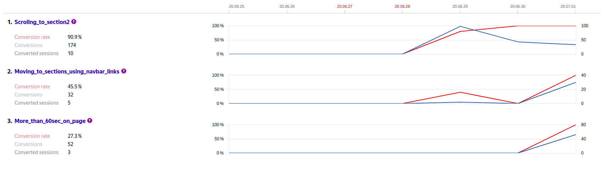
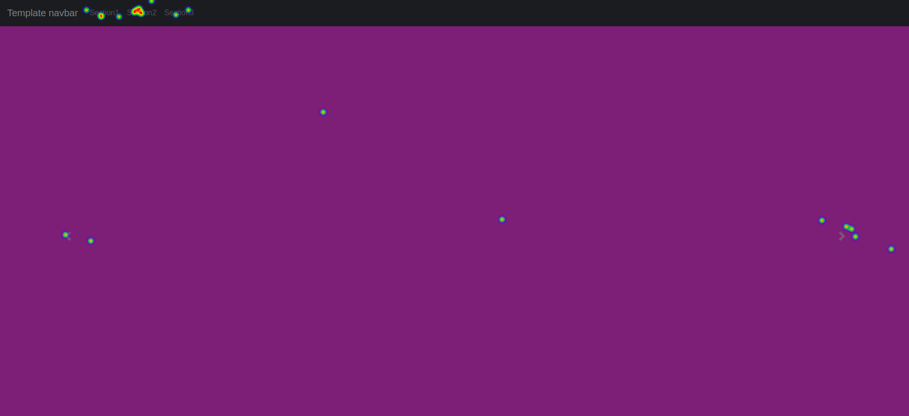
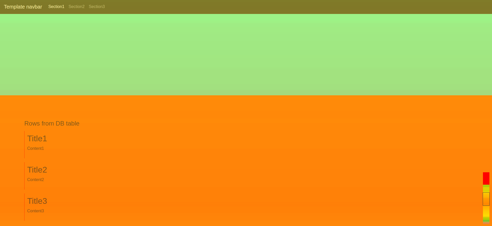

# Simple web application in Flask   with tracking and reporting website traffic
## Author: Walerij Hrul

### Description:
The application is a single-page website associated with web analytics services.

Additional js events for analysis detect:
- moving to sections on the page by using navbar links
- scrolling to a certain part of the page - section2
- being on the web site more than 1 minute

The application also includes: 
- setup parameters for *Yandex.Metrica heatmaps*
- simple *SQLite database*

Additionally, the application allows to:
- calculate the *average session duration, bounce rate, page views, etc.* (see Google Analytics Statistics example below)

### Used tools:
- micro web framework: **Flask 1.1.2** / **Python3**  
- web template engine: **Jinja2**
- web analytics services: **Google Analytics** and **Yandex.Metrica**
- CSS framework: **Bootstrap4**
- **jQuery**

### How to run the application:
1. use file *requirements.txt* for installing needed modules
   - *pip install -r requirements.txt*
2. run app:
   - for Linux and Mac: 
    *$ export FLASK_APP=app* 
    *$ export FLASK_ENV=development* 
    *$ flask init-db* 
    *$ flask run* 
   - for Windows cmd: 
    *> set FLASK_APP=app* 
    *> set FLASK_ENV=development* 
    *> flask init-db* 
    *> flask run* 

### Examples of analysis:
* **Google Analytics** 
    - Statistics: 
 
    - Goals: 
 
* **Yandex.Metrica** 
    - Goals: 
 
    - Click map: 
 
    - Scroll map 
 